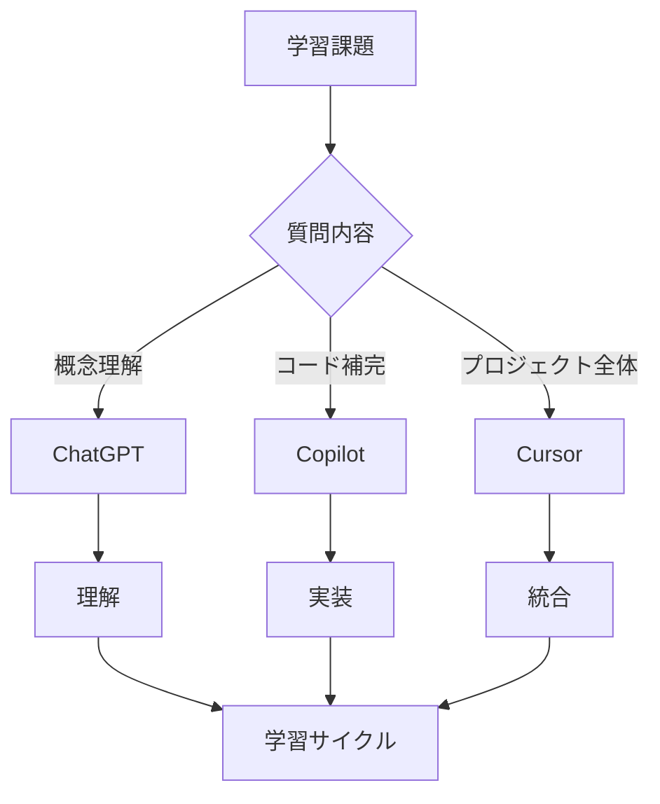

# GitHub Copilot 学習活用ガイド

## 目次

1. [はじめに](#はじめに)
2. [コード理解のための活用術](#コード理解のための活用術)
3. [効果的なプロンプト技法](#効果的なプロンプト技法)
4. [学習のベストプラクティス](#学習のベストプラクティス)
5. [対話的な学習体験](#対話的な学習体験)
6. [注意点と落とし穴](#注意点と落とし穴)
7. [他の AI ツールとの併用](#他のaiツールとの併用)
8. [まとめ](#まとめ)

---

## はじめに

### GitHub Copilot とは

GitHub Copilot は、コード補完や自動生成を行う「AI ペアプログラマー」です。本ガイドでは、単にコードを書くためではなく、**理解を深めるための教育的ツール**として活用する方法に焦点を当てます。

### 本ガイドの対象

- **学習者**: JavaScript/TypeScript、React、Next.js を学習中の開発者
- **環境**: VS Code、Cursor
- **目的**: Copilot を「メンター」や「ペアプログラマ」のように使い、理解を推し進めながらスキルを向上させる

### 重要な考え方

> 💡 **Copilot は作ってもらうツールではなく、理解を深めるためのツール**
>
> 使い方を誤ると学習を阻害する恐れがあるため、正しい活用法を身につけることが重要です。

---

## コード理解のための活用術

### 1. コードの説明を求める

#### 基本的な使い方

```javascript
// コードを選択して「このコードを説明して」と尋ねる
function calculateTotal(items) {
  return items.reduce((sum, item) => sum + item.price, 0);
}
```

**Copilot Chat での質問例:**

- 「この関数が何をするのか説明して」
- 「このコードの各行が何をしているか教えて」

#### メリット

- 自分で一行一行推測するより格段に早く概要を掴める
- 難解なコードに直面した際の学習補助になる
- 他人の書いたコードや新しいフレームワークのコードを読む際に有効

### 2. コメントとドキュメンテーションの生成

#### JSDoc 形式での活用

```javascript
/**
 * Copilotが関数の目的やパラメータの説明を補完
 */
function processUserData(userId, options) {
  // 実装...
}
```

#### 活用のポイント

- 関数の上にコメントを書き始めると、Copilot が補完してくれる
- Copilot 自身がコード内容を理解して要約している
- 見落としていたポイントに気付くきっかけになる

### 3. 理解を深める姿勢

**重要な原則:**

- 単に動かすだけでなく「理解しながら書く・読む」
- Copilot の説明をドキュメントと照らし合わせる
- 何度か質問したり異なる表現で聞いてみる

---

## 効果的なプロンプト技法

### 1. 自然言語のコメントで質問する

#### テクニック

```javascript
// この関数の目的は?
function fetchData() { ... }

/* 上記のコードを簡単に説明 */

// なぜこの実装になるのか?
// 別の方法はあるか?
```

#### ポイント

- Copilot は周辺のコードとコメントから文脈を読み取る
- 質問形式のコメントを入れると、回答を生成しようとする
- Copilot Chat が使えない場合でも有効

### 2. 具体的なプロンプトを書く

#### ❌ 曖昧な質問

```
// フォームをバリデーションする別の方法は?
```

#### ✅ 具体的な質問

```
// React + Next.js (App Router)で、
// 現在のCopilot提案とは異なるフォームバリデーションの
// 実装方法を教えて
```

#### なぜ重要か

- Copilot は提示されたコンテキストが明確なほど適切な回答を返す
- フレームワークや望む方針も含めて質問すると良い

### 3. 代替案や複数の回答を引き出す

#### 操作方法

- **VS Code**: `Alt + [` / `Alt + ]` で前後の候補を切り替え
- **候補ウィンドウ**: 複数の提案を一覧表示
- **Copilot Chat**: 「他の実装方法を教えて」と追問

#### 実践例

```javascript
// 最初の提案: シンプルな実装
const widgets = data.map((item) => <Widget key={item.id} {...item} />);

// 次の提案: 再帰を用いたより一般化された実装
const renderWidgets = (data, depth = 0) => {
  return data.map((item) => {
    if (item.children) {
      return (
        <Widget key={item.id} depth={depth}>
          {renderWidgets(item.children, depth + 1)}
        </Widget>
      );
    }
    return <Widget key={item.id} depth={depth} {...item} />;
  });
};
```

### 4. 理由や背景を尋ねる

#### 質問例

```javascript
// このアプローチの利点は何?
// 上記のロジックでなぜ十分なのか説明
```

**Copilot Chat での質問:**

- 「このコードを Python 開発者にもわかるよう説明して」
- 「なぜこの書き方になるのか?」
- 「このメソッドを選ぶ理由は?」

### 5. 設計や改善の相談をする

#### 相談例

- 「パフォーマンスを上げるにはどう書き直せる?」
- 「このコードが潜在的にバグを生むケースはあるか?」
- 「別のデータ構造を使うと良い場面は?」
- 「境界値ケースに対応できていないか?」

#### メリット

- 人間のペアプロが「ここはこう直したほうがいい」と教えてくれるのと同じ
- 提案についてさらに議論することで対話型の学習体験が生まれる

---

## 学習のベストプラクティス

### 1. 基礎知識をおろそかにしない

#### 重要な前提

- React や Next.js 自体の原理・仕組みを学んでおく
- AI の提案が正しいのか誤っているのか判断できる力を持つ
- 古いパターンや非推奨の書き方を見抜けるようになる

#### 具体例

```javascript
// ❌ Copilotが旧来のPages Router向けを提案
export async function getServerSideProps(context) {
  // Next.js 13+ App Routerでは非推奨
}

// ✅ 自分で気付いて修正
export async function generateMetadata() {
  // App Router向けの正しい実装
}
```

### 2. 提案コードを必ず読み解く

#### "Ask-Don't-Copy" 原則

> **説明を求め、丸写ししない**
>
> AI が提案したコードは一行一行説明できるようにせよ。説明できないなら、そのコードをコピーすべきではない。

#### チェックリスト

- [ ] 各行が何をしているのか説明できる
- [ ] なぜそのアプローチなのか理解している
- [ ] 他に方法はあり得るか考えた
- [ ] 説明できない部分は Copilot に質問した

### 3. AI に説明させてから実装する

#### 推奨フロー


#### 実践例

**ドラッグ&ドロップ機能の実装**

1. **質問**: 「ドラッグ&ドロップを実現するための主な考慮事項は?」
2. **比較**: 「HTML5 の API とライブラリどちらを使うべき?」
3. **実装**: 自分で onDragStart ハンドラを書く
4. **検証**: 「自分で書いたコードを見て問題がないか?」

### 4. テスト駆動や実行検証を取り入れる

#### Copilot でのテスト生成

```javascript
// 元の関数
function calculateDiscount(price, discountRate) {
  return price * (1 - discountRate);
}

// Copilotに依頼: 「この関数のユニットテストを書いて」
describe("calculateDiscount", () => {
  it("正しく割引を計算する", () => {
    expect(calculateDiscount(1000, 0.1)).toBe(900);
  });

  it("0%の割引を処理する", () => {
    expect(calculateDiscount(1000, 0)).toBe(1000);
  });

  it("100%の割引を処理する", () => {
    expect(calculateDiscount(1000, 1)).toBe(0);
  });
});
```

#### デバッグの学習

- エラーメッセージを自分で読み解く
- 「なぜ失敗したのか」を考える
- どうしても分からなければ Copilot に質問

### 5. Copilot でリファクタリング練習

#### プロンプト例

- 「もっと読みやすく書き直せる?」
- 「このロジックを簡潔にできる?」
- 「パフォーマンスを改善できる?」

#### 学習効果

- 「なぜこちらの方が良いのか」を考える
- Next.js や React のベストプラクティスを学ぶ
- AI が示す改善案を検討する過程が学習になる

### 6. ドキュメントと Copilot を併用する

#### 推奨ワークフロー

1. Copilot から説明を受ける
2. 公式ドキュメントの該当箇所を確認
3. AI の説明が正確か裏付ける
4. Copilot に「React 公式ではどんな推奨がある?」と質問
5. 理解を定着させ誤解を減らす

---

## 対話的な学習体験

### 1. 疑似ペアプロを演じる

#### 役割分担の例

**パターン A: 骨格を自分、細部を Copilot**

```javascript
// 自分: 骨格を書く
function UserProfile({ userId }) {
  // Copilotに任せる: データフェッチのロジック
}
```

**パターン B: Copilot に書かせて自分がレビュー**

- Copilot が書いたコードをレビュー
- 「ここの変数名はわかりづらい」→ 自分でリネーム
- 「この部分はもっと簡潔に書ける」→ 改善案を求める

#### 双方向のやりとり

- **自分 →Copilot**: 「この書き方だとエッジケースに対応できない?」
- **Copilot→ 自分**: 「境界値ケース X に対応できていない可能性があります」
- **自分 →Copilot**: 「なるほど、ではどう直すべき?」

### 2. チャット機能を活用する

#### 連続した質問の例

```
あなた: 「useEffectフックについて説明して」
Copilot: [基本的な説明]

あなた: 「では実際に副作用でAPIをフェッチする例を教えて?」
Copilot: [具体的なコード例]

あなた: 「クリーンアップ関数はいつ使う?」
Copilot: [詳細な説明]
```

#### メリット

- 会話の文脈を考慮した回答が得られる
- 段階的に理解を深めることができる
- 一度の回答で疑問が解消しなくても追加で尋ねられる

### 3. 自分の言葉で解説してみる

#### ラバーダッキング手法

```javascript
// 自分なりの説明をコメントで書く
// このuseEffectは、userIdが変更されたときに
// ユーザーデータをAPIから取得している。
// クリーンアップ関数でフェッチをキャンセルすることで、
// コンポーネントがアンマウントされた後の
// setState呼び出しを防いでいる。

useEffect(() => {
  let cancelled = false;
  fetchUser(userId).then((data) => {
    if (!cancelled) setUser(data);
  });
  return () => {
    cancelled = true;
  };
}, [userId]);
```

#### Copilot のフィードバック

- 誤りがあれば修正案を出してくれる
- 不足を補足する提案をしてくれる
- 自分が正しく理解したか自己検証できる

### 4. 適度に AI から離れる

#### 推奨アプローチ

```
1. まず自分で書いてみる (AIオフ)
2. どうしても詰まったらCopilotに助けを求める
3. AIの提案を受け入れる場合も必ず理解する
4. 定期的に「AIなしでも書けるか?」を確認
```

#### 補助輪の外し方

- 初期: AI に頼りながら学ぶ
- 中期: AI の提案を検証しながら使う
- 後期: AI なしでも書けるか挑戦
- 最終: Copilot をレビューツールとして使う

### 5. AI のミスを楽しむ

#### 学習のチャンスとして捉える

```javascript
// Copilotが提案したコードが動かない!
// ❌ 間違った依存配列
useEffect(() => {
  fetchData(query);
}, []); // queryの変更を検知できない

// なぜ動かないのか考える
// → 「依存配列にqueryがない」と気付く

// ✅ 修正
useEffect(() => {
  fetchData(query);
}, [query]);
```

#### 対処法

1. 「なぜこのコードは期待通りに動かないのか?」を自分に問いかける
2. 自分で修正を試みる
3. どうしても分からなければ Copilot に質問
4. 誤りの原因分析やデバッグでスキル向上

---

## 注意点と落とし穴

### 1. 誤った提案や不完全なコード

#### リスク

- AI は統計的にありそうなコードを出力しているだけ
- ロジック的に誤ったコードやバグを含む可能性がある
- 初心者は誤った提案を見抜けない場合がある

#### 対策

- **提案をそのまま受け入れない**: 必ず理解・検証する
- **コンテキストを整える**: 必要なファイルだけ開き、余計なノイズを減らす
- **方向付けする**: コメントで「○○ な実装にして」と指示

### 2. 古い情報や非推奨パターン

#### 問題

- 学習データは過去の公開リポジトリ
- 最新のベストプラクティスとは限らない
- React の古いクラスコンポーネントや Next.js の旧 API を提案することがある

#### 例

```javascript
// ❌ Copilotが提案: 古いクラスコンポーネント
class UserList extends React.Component {
  render() {
    /* ... */
  }
}

// ✅ 現在推奨: 関数コンポーネント + Hooks
function UserList() {
  const [users, setUsers] = useState([]);
  // ...
}
```

#### 対策

- 公式のアップデート情報を確認
- ChatGPT に「この方法は現在も推奨されるか?」と質問
- Deprecated メソッド名の警告コメントを見逃さない

### 3. セキュリティ・品質への無頓着

#### よくある問題

- ユーザー入力を適切にサニタイズしないコード
- エラー処理を省略したハッピーケースのみの実装
- パフォーマンス面で非効率な実装

#### 対策

```javascript
// Copilotに質問
// 「このコードに潜在的な問題はある?」
// 「セキュリティ上の懸念点は?」
// 「エッジケースへの対応は十分?」

// 自分自身でテストやレビューを通じて品質を担保
```

### 4. 依存症(学習の停滞)

#### 危険な兆候

- 自分でコードを書いたり問題解決する力が育たない
- エラーを自分で調べなくなる
- ドキュメントを読まなくなる
- 基礎体力が不足する

#### 推奨スタイル(初学者向け)

```
┌─────────────────────────────────┐
│ 初期数ヶ月の推奨アプローチ      │
├─────────────────────────────────┤
│ ✅ コードは自分で書く           │
│ ✅ 詰まったらAIに聞く           │
│ ✅ 解説だけを聞く               │
│ ❌ コード自動生成は使わない     │
└─────────────────────────────────┘
```

#### セルフチェック

- **常に自問**: 「今 AI 無しで自分はできるか?」
- **危ういと感じたら**: 一度 AI から離れてみる
- **定期的に**: Copilot 無しで実装してみる時間を設ける

### 5. ライセンスやプライバシー

#### 認識しておくべきこと

- トレーニングデータ由来のコードを提案
- ごく稀に他人のコードをそのまま出力する場合がある
- 自分の非公開コードが AI プロバイダ側に送信される

#### 基本的なリテラシー

- 機密情報を安易に AI に入力しない
- 鍵となるアルゴリズムの扱いに注意
- プロダクトに組み込む際はライセンスを確認

---

## 他の AI ツールとの併用

### 1. Copilot vs. ChatGPT

#### 比較表

| 項目             | GitHub Copilot               | ChatGPT              |
| ---------------- | ---------------------------- | -------------------- |
| **得意領域**     | コード補完・IDE 統合         | 詳細な説明・知識質問 |
| **コンテキスト** | 現在のファイルやプロジェクト | 自由な対話           |
| **回答形式**     | 短い提案・補完               | 長文の詳細な説明     |
| **使用場面**     | 実装中の補助                 | 概念理解・設計議論   |

#### 使い分けの例

```
┌──────────────────────────────────────┐
│ 学習フロー                           │
├──────────────────────────────────────┤
│ 1. ChatGPT: 概念を質問               │
│    「JavaScriptのクロージャとは?」   │
│                                      │
│ 2. Copilot: 実装でコード補完         │
│    実際にコードを書きながら学ぶ      │
│                                      │
│ 3. ChatGPT: 深掘り質問               │
│    「このコードの計算量は?」         │
│                                      │
│ 4. Copilot: レビュー・改善           │
│    「もっと読みやすく書き直せる?」   │
└──────────────────────────────────────┘
```

### 2. VS Code 拡張による ChatGPT 統合

#### 統合のメリット

- IDE 内から直接 ChatGPT に質問
- Copilot との役割分担
  - **Copilot**: コード補完ウィンドウで短い提案
  - **ChatGPT 拡張**: パネル上で長めの Q&A

#### 実践例

```javascript
// 1. ChatGPT拡張に質問
// 「Next.jsのAPI Routesの使い方」→ 理解を深める

// 2. Copilotで実装
export async function GET(request) {
  // Copilotが補完してくれる
}

// 3. ChatGPT拡張でレビュー
// コードを選択→「このコードをレビューして」
```

### 3. Cursor など AI 統合エディタ

#### Cursor の特徴

- VS Code ベースに AI 機能を強化
- プロジェクト全体をインデックス
- 高度なリファクタリング・一括編集

#### 学習用途での便利な機能

```
┌─────────────────────────────────────┐
│ Cursorの学習活用                    │
├─────────────────────────────────────┤
│ • リポジトリ全体をまたいだ質問      │
│   「このプロジェクトでユーザー      │
│    認証の仕組みを教えて」           │
│                                     │
│ • 複数ファイルに渡る変更提案        │
│   「このプロジェクトにReduxを       │
│    導入して」                       │
│                                     │
│ • 対話結果を即コードに反映          │
└─────────────────────────────────────┘
```

#### 注意点

- AI が自動生成・改変したコードはしっかり読み解く
- 自分のものにする意識を持つ

### 4. AI ツールの組み合わせで学習効果アップ

#### 推奨の組み合わせ



#### 実践的な使い分け

1. **ChatGPT**: 概要を教えてもらう
2. **Copilot**: 具体的に書く
3. **Cursor**: コード全体を整理する
4. **必要に応じて切り替え**: Copilot で難しい質問は ChatGPT へ

---

## まとめ

### GitHub Copilot を学習パートナーとして使う鉄則

#### ✅ すべきこと

1. **能動的に問いかける**

   - 「なぜ?」「どうして?」と常に質問
   - 説明や代替案を引き出す
   - 理由や背景を尋ねる

2. **自分の理解を主体に置く**

   - コードを丸呑みしない
   - 必ず自分の頭で咀嚼する
   - 説明できないコードは使わない

3. **検証と実践を繰り返す**

   - 公式ドキュメントと照らし合わせる
   - テストを書いて動作確認
   - 学んだことを自分でアレンジ

4. **適度な距離を保つ**
   - 定期的に AI なしで実装
   - 依存しない真の実力を身につける
   - AI を補助輪として徐々に外していく

#### ❌ 避けるべきこと

1. **盲目的な信頼**

   - AI の提案を無条件で受け入れる
   - エラーを読まずに AI に丸投げ
   - 基礎知識をおろそかにする

2. **受動的な使用**

   - ただコードを書かせるだけ
   - 理由を聞かない
   - 代替案を探さない

3. **過度な依存**
   - 常に AI 頼みでコードを書く
   - 自分で考えるプロセスを飛ばす
   - ドキュメントを読まなくなる

### 最終的な目標

> 💡 **Copilot から得た知見を、AI 無しでも応用できるスキルにする**
>
> Copilot は月に数千回もの提案をしてくれますが、そのうち何%を自分の血肉にできるかは使い手次第です。

### 学習サイクル

```
┌─────────────────────────────────────────┐
│  理想的な学習サイクル                   │
├─────────────────────────────────────────┤
│                                         │
│  1. 自分で考える                        │
│     ↓                                   │
│  2. Copilotに質問・相談                 │
│     ↓                                   │
│  3. 提案を理解・検証                    │
│     ↓                                   │
│  4. 自分の言葉で説明                    │
│     ↓                                   │
│  5. 実践で試す                          │
│     ↓                                   │
│  6. AI無しでも書けるか確認              │
│     ↓                                   │
│  [繰り返し]                             │
│                                         │
└─────────────────────────────────────────┘
```

### 対話的な教育ツールとしての活用

GitHub Copilot をペアプログラマーやメンターのように使い、楽しく効率的なプログラミング学習を進めてください。以前よりも早く、そして深く JavaScript/TypeScript や React、Next.js の世界を習得できることでしょう。

---

## 参考リンク

### 公式リソース

- [GitHub Copilot Documentation](https://github.blog)
- [React 公式ドキュメント](https://react.dev)
- [Next.js 公式ドキュメント](https://nextjs.org/docs)

### 学習リソース

- [Codédex - Learn GitHub Copilot](https://www.codedex.io/github-copilot)
- [Frontend Mentor - AI Coding Assistants for Beginners](https://www.frontendmentor.io/articles/ai-coding-assistants-for-beginners)
- [AlgoCademy Blog - Copilot Suggestions](https://algocademy.com/blog)

### コミュニティ

- Reddit: r/nextjs
- GitHub Discussions
- Stack Overflow

---

**Last Updated**: 2025 年 12 月 1 日
**Version**: 1.0
